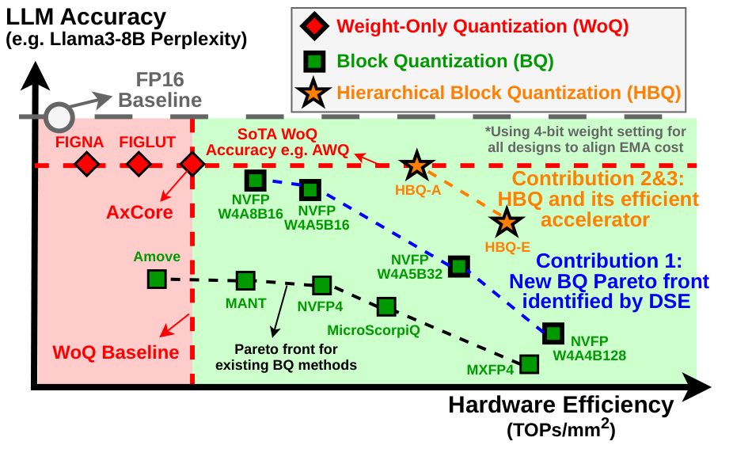

# HBQ: Hierarchical Scaling Block Quantization

Official code for **"HBQ: Hierarchical Scaling Block Quantization with Hardware-Efficiency-Aware
Design for Accurate LLM Inference"**, accepted to the 59th IEEE/ACM International Symposium on
Microarchitecture (**MICRO 2026**).

Chun-Ting Chen, Dongmin Han, Hangyeol Mun, Jake Hyun, Arnab Raha, Amit Agarwal, Mark Anders,
Mohamed Abdelfattah, Jae-sun Seo

📄 **Paper:** [arXiv:2609.00450](https://arxiv.org/abs/2609.00450)

<p align="center">
  
</p>

<p align="center"><em>HBQ pushes the accuracy&ndash;efficiency Pareto front: achieve
weight-only accuracy at block-quantization hardware cost.</em></p>

## Results

### Accuracy vs. weight-only and block-quantization baselines

WikiText-2 perplexity (lower is better) and zero-shot accuracy (higher is better, mean of
WinoGrande and PIQA). Area per MAC is from TSMC 28nm synthesis. Full results across all seven
models (Llama-2-7B, Llama-3-8B, Llama-3.1-70B, Llama-3.2-3B, Qwen2.5-3B/7B, Mixtral-8x7B) are in
the paper.

| Method | W/A<sup>a</sup> | Llama-3-8B PPL | 0-shot | Qwen2.5-3B PPL | 0-shot | Area/MAC (µm²) |
|---|---|---|---|---|---|---|
| Baseline (FP16) | 16/16 | 6.14 | 77.2 | 8.01 | 73.6 | – |
| AWQ | 4.13/16 | 6.53 | 76.5 | 8.46 | 72.6 | 200<sup>b</sup> |
| MicroScopiQ | 4.23/4.23 | 6.89 | – | – | – | 90<sup>c</sup> |
| MXFP4 | 4.25/4.25 | 7.98 | 72.9 | 11.0 | 69.2 | **64** |
| NVFP4 | 4.5/4.5 | 6.88 | **76.4** | 8.92 | 72.0 | 93 |
| **HBQ-E** | 4.13/5.13 | 6.68 | 75.8 | 8.73 | 73.0 | 72 |
| **HBQ-A** | 4.31/5.31 | **6.52** | **76.4** | **8.55** | **73.6** | 87 |

Bold marks the best result among methods that quantize **both** weights and activations. AWQ is
weight-only (W4/A16), so it is listed for reference rather than as a like-for-like comparison —
it keeps activations in FP16 and, on Qwen2.5-3B, reaches a lower PPL (8.46) than any W&A-quantized
method here, at 2.3× the area per MAC.

<sup>a</sup> Effective bit-width, including scaling factors. 
<sup>b</sup> Uses the AxCore PE as the weight-only-quantization area baseline. 
<sup>c</sup> Reflects the aggressive bit truncation adopted in the MicroScopiQ PE design. 
MicroScopiQ numbers are taken from its original paper.

### Reasoning task accuracy

| Method | W/A/KV | 8B GSM8K | 8B HumanEval | 8B MMLU | 3B GSM8K | 3B HumanEval | 3B MMLU | Avg. |
|---|---|---|---|---|---|---|---|---|
| *No KV cache quantization* | | | | | | | | |
| Baseline (FP16) | 16/16/16 | 86.2 | 59.2 | 68.4 | 77.0 | 44.5 | 59.9 | 65.9 |
| AWQ | 4/16/16 | **83.0** | **56.7** | **66.8** | 74.0 | 42.1 | **58.7** | 63.6 |
| **HBQ-E** | 4/5/16 | 82.3 | 52.4 | 66.1 | 73.8 | **48.8** | 57.3 | 63.7 |
| **HBQ-A** | 4/5/16 | **83.0** | 55.5 | 66.4 | **75.7** | 47.0 | 58.5 | **64.3** |
| *With KV cache quantization* | | | | | | | | |
| MXFP | 4/4/4 | 35.0 | 15.2 | 42.0 | 20.7 | 12.8 | 39.0 | 27.5 |
| MXFP | 4/8/4 | 64.4 | 33.5 | 59.7 | 60.5 | 36.6 | 53.1 | 51.3 |
| NVFP | 4/4/4 | 68.0 | 45.1 | 60.6 | 61.9 | 35.4 | 51.4 | 53.4 |
| NVFP | 4/8/4 | 77.9 | 48.8 | 64.3 | 69.8 | 38.4 | 55.8 | 59.2 |
| **HBQ-E** | 4/5/4 | 74.0 | 47.6 | 62.2 | 63.4 | **42.7** | 54.4 | 57.9 |
| **HBQ-A** | 4/5/4 | **80.7** | **53.1** | **64.5** | **70.7** | 37.8 | **56.2** | **60.7** |

8B = Llama-3.1-8B-Instruct, 3B = Llama-3.2-3B-Instruct. Bold marks the best quantized result in
each column, within each group.

## Repository layout

| Path | Contents |
|---|---|
| `main.py`, `src/` | The PTQ simulator. Patches a Hugging Face model with quantization-aware attention/MLP modules, fake-quantizes it, and evaluates. See `src/quantizer.py` for the formats and `src/ptq.py` for how they are applied |
| `config/` | Paired YAMLs: one model/benchmark config plus one quantization config per run. Every key is documented in [`config/README.md`](config/README.md) |
| `script/` | Reproduction drivers for each figure and table in the paper — [`script/README.md`](script/README.md) maps them one to one |
| `hardware/` | SystemVerilog PE and accelerator designs plus the Synopsys DC/PrimeTime sweeps behind the area and energy numbers — [`hardware/README.md`](hardware/README.md) |
| `blockquant_ext_src/` | CUDA GEMM extension for FP16 and partial-sum-quantized accumulation |
| `vllm/` | Long-generation evaluation (GSM8K, MATH-500) on vLLM. Separate conda environment — [`vllm/README.md`](vllm/README.md) |
| `llm-awq/` | Vendored AWQ W4/g128 baseline. Separate conda environment — [`llm-awq/README.md`](llm-awq/README.md) |
| `save/` | Evaluation logs and result TSVs written at run time (gitignored) |

## Setup conda environment
```bash
conda env create -f environment.yml
conda activate hbq
```

Build the local CUDA extension for FP16 and psum quantization kernels:

```bash
cd blockquant_ext_src
pip install ninja setuptools wheel
pip install -e . --no-build-isolation
cd ..
```

## Usage
```bash
python main.py --config_dir {model/benchmark config yaml} --quant_config {quantization config yaml}

# Example: Llama3-8B with HBQ-A on wikitext
python main.py --config_dir config/llama3-8b_wiki.yaml --quant_config config/hbq_a.yaml

# Llama3.1-8B-instruct with HBQ-E w/ KV cache quantization on MMLU
python main.py --config_dir config/llama3.1-8b-ins_mmlu.yaml --quant_config config/hbq_a_kv.yaml
```

## Nuances didn't mention in the paper:
- When using FP8-scale under high activation precision (>= 6-bit), FP8-scale face similar scaling factor quantization error as the floor/rounding issue in PoT-scale. So we use *use_ceil* to calculate FP8 scaling when activation is >= 6-bit. See quantizer.py MXFPQuantizer.get_shared_scale() for how the scaling factor is calculated. *use_ceil* is set by quantization configuration yml file with *block_quant/act_scale_use_ceil* and *block_quant/wgt_scale_use_ceil*.
- For PoT-round (mentioned in Section 2.2.1 and Figure 3), we found out that only qk projection benefits from rounding, PoT-floor is better for other layers. So we only use rounding in QK. Rounding is set by quantization configuration yml file with *block_quant/qk_mx_round*.

## Artifact Reproduction

See script/README.md

## Citation

GitHub's "Cite this repository" button reads `CITATION.cff`; the BibTeX below is the same entry.

```bibtex
@inproceedings{chen2026hbq,
  title     = {{HBQ}: Hierarchical Scaling Block Quantization with Hardware-Efficiency-Aware
               Design for Accurate {LLM} Inference},
  author    = {Chen, Chun-Ting and Han, Dongmin and Mun, Hangyeol and Hyun, Jake and
               Raha, Arnab and Agarwal, Amit and Anders, Mark and Abdelfattah, Mohamed and
               Seo, Jae-sun},
  booktitle = {Proceedings of the 59th IEEE/ACM International Symposium on Microarchitecture
               (MICRO)},
  year      = {2026},
  eprint    = {2609.00450},
  archivePrefix = {arXiv}
}
```

## Acknowledgments

This repository builds on several open-source projects:

- **[llm-awq](https://github.com/mit-han-lab/llm-awq)** — MIT License, © 2023 MIT HAN Lab. Vendored under `llm-awq/` and used as the AWQ W4/g128 baseline reported in the paper. Modified to evaluate through lm-evaluation-harness 0.4, to quantize weights in simulation (`--q_backend fake`, so no CUDA kernel build is required), and to shard the AWQ search across multiple GPUs for models that do not fit on one device. The upstream license is retained verbatim at `llm-awq/LICENSE`, and `llm-awq/README.md` lists the changes.
- **[lm-evaluation-harness](https://github.com/EleutherAI/lm-evaluation-harness)** — EleutherAI. Used for all downstream task evaluation (wikitext, winogrande, piqa, mmlu, gsm8k, humaneval).
- **[vLLM](https://github.com/vllm-project/vllm)** — used for the long-generation evaluations under `vllm/`.

HBQ's own code is released under the MIT License; see `LICENSE`.
