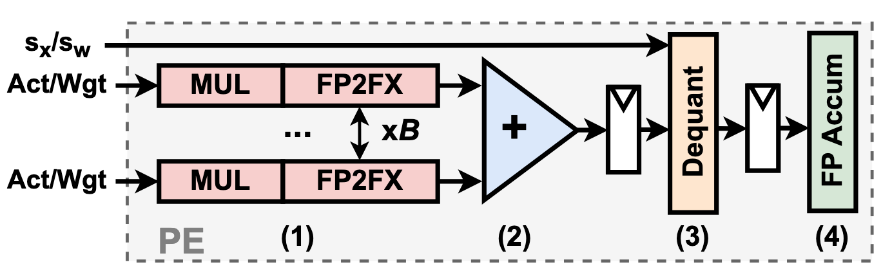

# RTL Implementation of all PE modules

## 📂 Repository Overview

This repository provides the hardware artifacts for **"HBQ: Hierarchical Scaling Block Quantization with Hardware-Efficiency-Aware Design for Accurate LLM Inference", Chen et al.**. It includes baseline Processing Element (PE) designs for BQ baselines, including all designs explored in *Section 4. BQ Design Space Exploration* such as MXFP4 and NVFP4 as well as Amove, and also HBQ PE design.  

---

## 🏛️ Directory Structure

### 1. Baseline Block Quantization Processing Elements (BQ PE)



Baseline BQ PE used in DSE (Section 4). We have three PE designs to cover different exploration space. *params.vh* is the configuration file for each PE to tune different knobs.

In the main module SystemVerilog file MAC*.sv, MAC module with *_MX postfix means it uses PoT-scale, *_NV postfix means it uses FP8-scale, without any of two means it can be reconfigurated by the argument. You can change the top-level module in .tcl file to change the scaling scheme.

---

#### 1.1 BQ/MAC_WXAY

Basic BQ PE module that performs BQ MAC with **FP format with E2MX**. FP with 2-bit exponent is the optimal configuration we found in most of the BQ setting (see paper Section 4.2). For instance if W4A8 is set, then the module uses FP4 w/ E2M1 on weight and FP8 w/ E2M5 on activation. This module allows user to tune following knobs (variable names in params.vh shown in parenthesis):
1. Weight precision (parameter int X)
2. Activation precision (parameter int Y)
3. Block size (parameter int B)
4. Scaling methods: PoT-scale or FP8-scale (tune this knob by synthesize different MAC, _MX and _NY variation)

Paper result reproduction: This module covers Figure 3, Figure 4(b), Figure 5, Figure 6, and Table 9 (area for MXFP/NVFP).

#### 1.2 BQ/MAC_EM
Basic BQ PE module using FP format that allows user to tune different exponent and mantissa combination. Tunable knobs (variable names in params.vh shown in parenthesis):
1. Activation precision(integer int Y)
2. Activation exponent bit (integer int E), mantissa bit is adjusted by Y and E
3. Block size (parameter int B)
4. Scaling methods: PoT-scale or FP8-scale (tune this knob by synthesize different MAC, _MX and _NY variation)

The weight format is fixed to FP4 E2M1.

Paper result reproduction: This module covers Figure 4(b), Figure 5.

#### 1.3 BQ/MAC_int
Basic BQ PE module using integer for both activation and weight. Tunable knobs:
1. Activation precision 
2. Weight precision
3. Block size
4. Scaling methods (PoT-scale or FP8-scale)

Paper result reproduction: This module covers Figure 4(b), Figure 5.

---

### 2. HBQ PE
Implementation of HBQ PE. *params.vh* is the configuration file for each PE to tune different knobs.

You can tune *SUB_B* in params.vh to reproduce HBQ-E (SUB_B=32) and HBQ-A (SUB_B=8).

Paper result reproduction: This module covers Figure 10 and Table 9.

---

## Paper Result Reproduction Guideline
We use TSMC 28nm PDK with tt 0.9V 25C corner.
To run all synthesis result used in the paper, please setup proper path to your PDK in all .tcl under BQ/ and HBQ/ and run:

``` bash
cd hardware/BQ/MAC_WXAY && python3 run_dc_sweep.py # BQ with different block size/act bit
cd hardware/BQ/MAC_EM && python3 run_dc_sweep.py # different FP format PE 
cd hardware/BQ/MAC_int && python3 run_dc_sweep.py # INT format
cd hardware/HBQ && python3 run_dc_sweep.py # HBQ with different uB
```

We provide the final area result table in *tsv files, which is used in the plotting script under script/.

Note: We use output stationary dataflow in our DSE. We amortize the register cost in each PE by a factor of 4, it effectively means 4 PEs share a single register for weight and activation to amortize register cost.

---